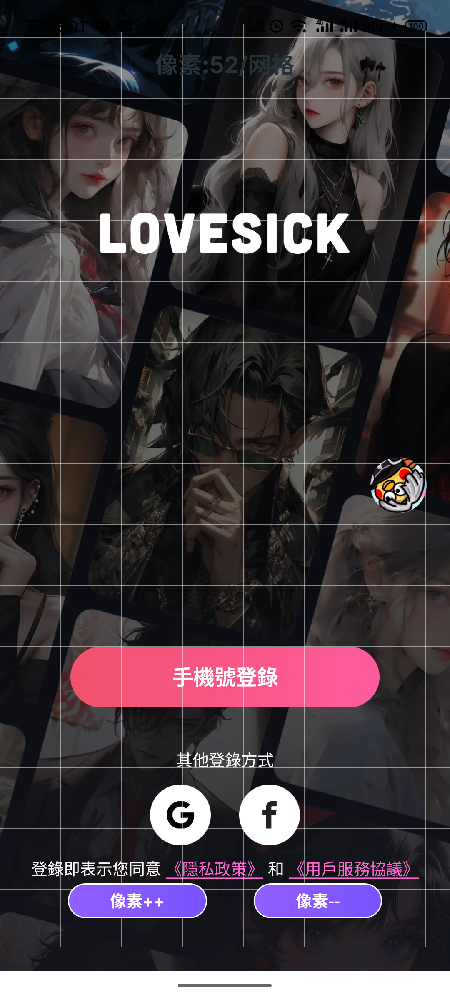

## UI走查工具介绍

### 一、App概述

本App是一款用于程序猿进行视觉还原走查工具，主要提供像素对比和视觉还原对比两大核心功能。用户可以通过本App轻松实现图像细节的精确对比，以及视觉效果的还原分析，能大大提高开发视觉还原度。

### 二、功能介绍

<strong>像素对比功能</strong>

像素之眼用于对比控件的大小和设计稿之间的差异，通过调整网格像素大小，App能够精确地展示出设计稿和app在像素级别上的差异，帮助用户快速定位控件中的变化区域。

<strong>视觉还原对比功能</strong>

视觉还原对比功能旨在帮助用户比较设计稿与处理后的图像在视觉效果上的差异。用户可以上传处理前后的图像，App将通过先进的图像处理技术，还原出处理前图像的真实视觉效果。用户可以通过对比原始图像和还原图像，评估处理效果是否符合预期，从而优化图像处理流程。

### 三、使用方法

下载与安装
可以点击这里下载文件：[UI工具](release/app-release.apk)

并安装App，或自己下载源码进行编译，安装完成后即可使用。

像素对比功能无需任何操作即可开启。
视觉还原对比功能需要先将设计稿拷贝到手机sd卡上，并且在APP中选择参考图片后即可开启功能

### 四、注意事项

请确保设计稿图像格式和分辨率符合App的要求，以保证对比结果的准确性。
我们推荐设备分辨率与设计稿的分辨率一致（如设计稿的分辨率为1080P，那么设备的分辨率最好也是1080P），避免出现分辨率不一致导致偏差问题。

### 五、联系与支持

如在使用本App过程中遇到任何问题或建议，欢迎通过以下方式联系我们：

邮箱：[jixiongxu2017@gmail.com]
我们将竭诚为您提供帮助和支持。

本App将持续更新和优化功能，以满足用户的不断需求。感谢您的使用！
